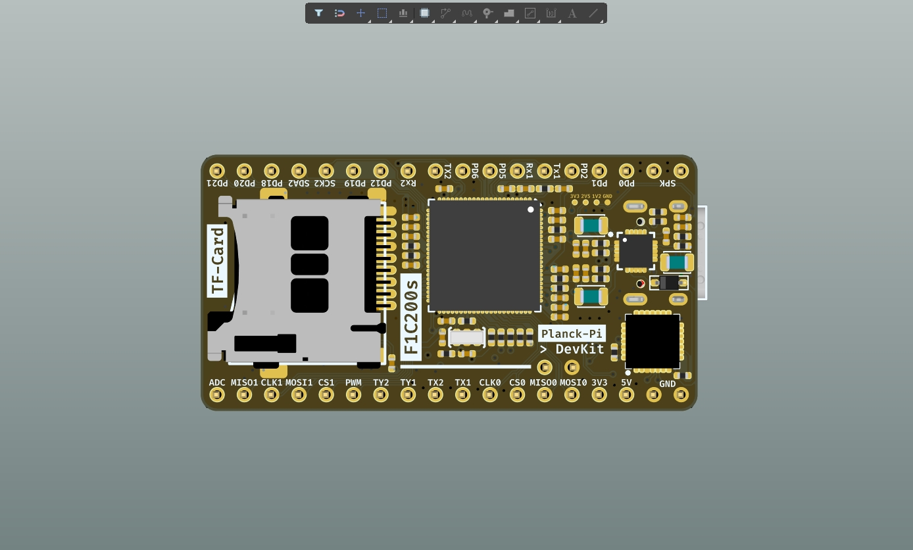
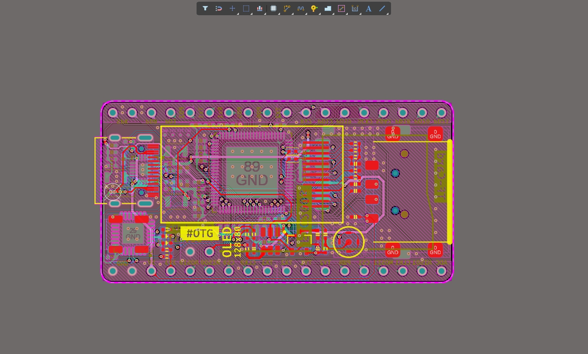
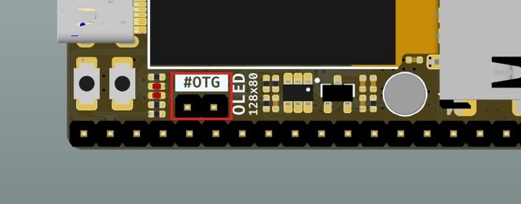

- [ 0.说明](#head1)
	- [ 芯片介绍](#head2)
	- [ 基础知识](#head3)
		- [1. F1Cxxxs芯片的上电启动顺序](#head4)
		- [2. 开发工具链下载](#head5)
- [ 1.硬件开发](#head6)
- [ 2.环境准备](#head7)
	- [2.1 准备Docker开发环境](#head8)
		- [2.1.1 安装依赖软件](#head9)
		- [2.2.2 安装编译工具链](#head10)
	- [2.3 编译一遍buildroot获取基础源码](#head11)
	- [2.4 常规编译方法](#head12)
	- [2.5 烧写方法](#head13)
- [ 3.u-boot开发](#head14)
- [ 4.Linux内核开发](#head15)
- [ 5.root-fs开发](#head16)
	- [5.1 准备环境](#head17)
	- [5.2 构建Debian文件系统](#head18)
	- [5.3 配置文件系统](#head19)
		- [5.3.1 最小配置](#head20)
		- [5.3.2 增加开机自启脚本](#head21)
		- [5.3.3 解决root-fs分区开机后被挂载为*Read-Only*的问题](#head22)
		- [5.3.4 添加USB-OTG  & Gadget-RNDIS功能](#head23)
		- [5.3.5 启用swap](#head24)
	- [ 5.4 打包&部署文件系统](#head25)
- [ 6.应用开发](#head26)
	- [6.1 系统应用集成](#head27)
	- [6.2 驱动开发](#head28)
	- [6.3 Linux App开发](#head29)
- [ 7.问题总结](#head30)
[TOC]

## <span id="head1"> 0.说明</span>

> 本项目是一个基于全志F1C200s芯片的超迷你&低成本的Linux开发板，本来是用于个人的某个小项目调试，现把所有硬件、软件（u-boot、内核、root-fs）开源出来。
>
> **板载资源：**
>
> * 一个OLED 128x80
> * 一个麦克风 & 功放可以外接喇叭
> * 双面不同功能的Type-C接口分别提供`USB转串口`以及`USB-OTG`功能
> * 一个USB-A口用于外接设备
> * SD卡插槽
> * 引出绝大部分IO
>
> 板卡成本应该不到50RMB，而且提供了很多资料，很适合用于新手作为入门Linux学习的开发板。




### <span id="head2"> 芯片介绍</span>

> 全志F1C200s是全志的一款高度集成、低功耗的移动应用处理器，可用于多种多媒体音视频设备中。

`F1C200s`基于ARM 9架构，芯片集成了SiP的DDR，外围电路可以极其简单；它支持高清视频解码，包括H.264、H.263、MPEG 1/2/4等，还集成了音频编解码器和I2S/PCM接口，是一款开发简单、性价比较高的产品，也适合用来做入门级的Linux开发板。

---

| 功能         | 描述                                                         |
| ------------ | ------------------------------------------------------------ |
| CPU          | ARM9 CPU architecture，16KByte D-Cache，2KByte I-Cache       |
| Memory       | SIP 64MB DDR1，SD2.0，eMMC 4.41                              |
| Video        | H.264 1920x1080@30fps decoding<br/>MPEG1/2/4 1920x1080@30fps decoding<br/>MJPEG 1280x720@30fps encoding<br/>JPEG encode size up to 8192x8192 |
| Camera       | 8-bit CMOS-sensor interface<br/>CCIR656 protocol for NTSC and PAL |
| Audio        | Integrated analog audio codec with two DAC channels and one ADC channel,maximum 192kHz DAC sample rate and 48kHz ADC sample rate<br/>One I2S/PCM interface |
| Display      | LCD RGB interface up to 1280x720@60fps<br/>TV CVBS output, support NTSC/PAL, with auto plug detecting |
| Connectivity | USB OTG, SDIO,IR, 3 x TWI, 2 x SPI, 3 x UART                 |
| OS           | Melis, Linux OS                                              |
| Package      | QFN88, 10mm x 10mm                                           |
| Process      | 40nm                                                         |
| 特点         | 支持H.264 1920x1080@30fps 解码<br/>支持MJPEG 1280x720@30fps 编码<br/>集成 64MB DDR1,集成音频CODEC<br/>低成本，低功耗，开发简单 |

**与其他系列芯片的对比：**


### <span id="head3"> 基础知识</span>

#### <span id="head4">1. F1Cxxxs芯片的上电启动顺序</span>

> 芯片可以从SPI Flash或者SD-Card中启动，因为Flash容量较小可玩性不高，后文都是以SD卡启动为主的。
>
> **参考：**[F1C100s启动时搜索SPI Flash的顺序？](https://whycan.com/t_1746.html)
>
> 1. 上电后, f1c100s内部 BROM (芯片内置，无法擦除) 启动；
> 2. 首先检查 SD0 有没有插卡, 如果有插卡就读卡 8k偏移数据，是否是合法的启动数据, 如果是BROM 引导结束, 否则进入下一步；
> 3. 检测SPI0 NOR FLASH(W25QXXX, MX25LXXX) 是否存在, 是否有合法的启动数据, 如果是BROM 引导结束, 否则进入下一步；
> 4. 检测SPI0 NAND FLASH 是否存在, 是否有合法的启动数据, 如果是BROM 引导结束, 否则进入下一步；
> 5. 因为找不到任何可以引导的介质， 系统进入usb fel 模式， 可以用USB烧录了。

#### <span id="head5">2. 开发工具链下载</span>

> 编译工具链官网：https://www.linaro.org/
>
> 或[Arm GNU Toolchain](https://developer.arm.com/tools-and-software/open-source-software/developer-tools/gnu-toolchain)，以linaro为例：进入`support->downloads`可以看到下载页面，点击`GNU cross-toolchain binary archives`，可以进入对应[下载列表](https://releases.linaro.org/components/toolchain/binaries/)，可以看到各个版本的toolchain，这里我使用的`latest-7/arm-linux-gnueabi/`即`gcc-linaro-7.5.0-2019.12-x86_64_arm-linux-gnueabi`即可。
>

## <span id="head6"> 1.硬件开发</span>



原理图见仓库的源文件和PDF，需要说明的点是：

* 板子的Type-C采用正反插不同功能，正面是USB转TTL串口功能，用于内核调试，反面是芯片的USB功能，在内核中我开启了USB的RNDIS网卡也就是说可以通过这个USB口模拟出一个网卡然后共享电脑的网络，**也就不需要外接WiFi和以太网模块了很方便。**

* 由于芯片只有一个USB接口，因此为了能使板子作为Host外接其他设备，我在板卡上添加了一个OTG的跳线：

  

  正常情况下不接跳线的话OTG功能为Device模式，也就是可以通过TypeC接口模拟网卡或者其他设备如MTP；当插上跳线帽之后，就可以作为Host在右边的A口插入USB设备了如U盘、键盘、鼠标等，**注意此时C口的USB功能失效，需要通过串口登录板子。**

## <span id="head7"> 2.环境准备</span>

**推荐直接使用我配置好的完整镜像，用Etcher等工具直接烧写到SD卡里即可以使用，方便又好用~**

> 镜像的账户：
>
> * pi 密码：planck
> * root 密码：planck


下面的教程是给需要自己配置uboot、内核、文件系统的人看的。

### <span id="head8">2.1 准备Docker开发环境</span>

为了最小化编译环境，这里采用Docker构建ubuntu20.04镜像的方式来搭建环境。

#### <span id="head9">2.1.1 安装依赖软件</span>

首先需要自己安装一下Docker（百度一下教程），然后pull一下Ubuntu官方的Docker镜像到本地，选择版本为`ubuntu:20.04`：

```
sudo docker pull ubuntu:20.04
```

> 实际操作中使用了我自己预先配置好的本地镜像（安装了nano、ssh等软件，更新了国内的apt源等）。

然后启动容器（修改为你自己的相关路径）：

```
sudo docker run -it --name planck-pi-env --network host \
-p 8022:22 \
-v /home/pengzhihui/WorkSpace:/workspace \
--privileged \
planck-pi-env.image:latest
```

进入容器之后执行`apt update`核`apt upgrade`更新软件，接下来安装依赖的软件包：

```
sudo apt-get install xz-utils nano wget unzip build-essential git bc swig libncurses5-dev libpython3-dev libssl-dev pkg-config zlib1g-dev libusb-dev libusb-1.0-0-dev python3-pip gawk bison flex 
```

#### <span id="head10">2.2.2 安装编译工具链</span>

按照前文介绍的地址下载工具链（可以在VMware宿主机进入共享文件夹操作）：

```
wget http://releases.linaro.org/components/toolchain/binaries/7.2-2017.11/arm-linux-gnueabi/gcc-linaro-7.2.1-2017.11-x86_64_arm-linux-gnueabi.tar.xz
```

> **注意：**GCC版本要大于 6；此处为获取交叉编译链为7.2.1版本，也可以自行下载其他版本。

将工具链压缩包解压：

```
 mkdir /usr/local/arm 
 tar -vxf gcc-linaro-7.2.1-2017.11-x86_64_arm-linux-gnueabi.tar.xz -C /usr/local/arm 
```

配置环境变量：

```
nano  ~/.bashrc
```

打开文件添加下面的变量：

```
export PATH=$PATH:/usr/local/arm/gcc-linaro-7.2.1-2017.11-x86_64_arm-linux-gnueabi/bin
```

使环境变量立即生效 ：

```
source ~/.bashrc 
```

查询版本，确认安装成功 ：

```
arm-linux-gnueabi-gcc -v
```

配置完成后可以commit容器到镜像方便未来部署：

```
sudo docker commit planck-pi-env planck-pi-env.image
sudo docker save -o planck-pi-env.image.tar planck-pi-env.image
```

### <span id="head11">2.3 编译一遍buildroot获取基础源码</span>

cd到源码目录，然后调用defconfig：

```
make widora_mangopi_r3_defconfig
```

`make -j4`是多线程编译方式，后边的数字代表你的计算机内核线程数。

```
make -j4
```

编译完后，输出文件在 `output/images/`下：

```
ls output/images/*.img
output/images/sysimage-nand.img  output/images/sysimage-nor.img  output/images/sysimage-sdcard.img
```

> **修改dts后，如何编译生效：**
>
> ```
> rm ./output/images/*.dtb
> make linux-clean-for-rebuild
> make linux -j8
> make
> ```
>
> 所有被支持的make命令可以通过`make help`打印出来：
>
> ```
> make clean   (清理编译输出文件)
> make distclean   (不仅清理编译输出，还清理dl目录以及config文件，慎用)
> make toolchain  (编译一份适应目标cpu的工具链)
> make menuconfig (配置软件包菜单)
> make busybox-menuconfig  (busybox软件包配置)
> make uboot-menuconfig (uboot软件包配置)
> make linux-menuconfig (linux软件包配置)
> make -j4  (4线程编译)
> ```

### <span id="head12">2.4 常规编译方法</span>

进入源码目录, 执行下述命令进行编译: 

```
make ARCH=arm CROSS_COMPILE=arm-linux-gnueabi- -j4
```

> 在uboot顶层`Makefile`的250行左右，添加默认编译器，就可以直接用`make`编译省去后面的参数了:
>
> ```
> ifeq ($(HOSTARCH),$(ARCH))
> CROSS_COMPILE ?= 
> endif
> 
> ARCH ?= arm
> CROSS_COMPILE ?= arm-linux-gnueabi-
> ```

### <span id="head13">2.5 烧写方法</span>

> FEL烧写方法这里不使用, 有兴趣可以参考这些教程了解: 
>
> * [全志sunxi-tools烧录工具安装和使用](https://blog.csdn.net/p1279030826/article/details/112719638)
> * [全志V3S 编译运行xboot笔记](https://www.cnblogs.com/bigmagic/p/12373290.html)

**这里介绍TF卡的烧写方法。**

在TF卡上构建系统之前，需要将TF卡进行分区与格式化。

> 也可以使用GParted等软件做图形化的操作：
>
> 

命令行方式如下，首先查看电脑上已插入的TF卡的设备号（一般为 /dev/sdb1,下面以/dev/sdb1为例：

```
sudo fdisk -l 
```

若自动挂载了TF设备，先卸载（有多个分区则全部卸载）：

```
sudo umount /dev/sdb1...
```

进行分区操作：

```
sudo fdisk /dev/sdb
```

操作步骤如下：

1. 若已存分区即按 d 删除各个分区

2. 通过 n 新建分区，第一分区暂且申请为1M用于储存uboot-with-spl，第二分区32M用于储存Linux内核，剩下的空间都给root-fs

	> * **第一分区操作**：p 主分区、默认 1 分区、默认2048、+16M
	>
	>   ```
	>   n p [Enter] [Enter] [Enter] +1M
	>   ```
	>
	> * **第二分区操作**：p 主分区、2 分区、默认2048、+128M
	>
	>   ```
	>   n p [Enter] [Enter] [Enter] +128M
	>   ```
	>
	> * **第三分区操作**：p 主分区、3 分区、默认2048，剩下的全部分配
	>
	>   ```
	>   n p [Enter] [Enter] [Enter] [Enter]
	>   ```
	>
	> * w 保存写入并退出

分区格式化：

```
sudo mkfs.vfat /dev/sdb1 # 将第1分区格式化成FAT
sudo mkfs.ext4 /dev/sdb2 # 将第2分区格式化成FAT  
sudo mkfs.ext4 /dev/sdb3 # 将第3分区格式化成EXT4
```

> **格式说明：**
>
> * EXT4：只用于Linux系统的内部磁盘
> * NTFS：与Windows共用的磁盘
> * FAT：所有系统和设备共用的磁盘

使用dd将`u-boot-sunxi-with-spl.bin`烧写进第一分区：

```
sudo dd if=path/to/u-boot-sunxi-with-spl.bin of=/dev/sdb bs=1024 seek=8
sync
```

> **注意：**这里的`bs=1024 seek=8`是添加了8192字节的偏移，之所以要加8K偏移是因为FSBL也就是bootROM里面硬写死了会从设备的8K地址处加载SPL，然后进入uboot。因此上面烧写的时候，指定的偏移地址一定是**相对于储存设备硬件的偏移，而不是相对于分区的偏移**！
>
> * 8K的来源是参考`buildroot-mangopi-r/board/allwinner/generic/genimage-sdcard.cfg`文件的描述`offset = 0x2000`。
> * 是否单独划分一个uboot分区其实不重要，因为烧写的时候直接覆盖了但是我们人为设置一个1M大小的区间分隔开，便于和后面的内核储存分区区分。
> * 关于genimage的使用，可以参考billdroot官方的文档描述：[The Buildroot user manual](https://buildroot.org/downloads/manual/manual.html#writing-genimage-cfg) 。
>
> ```
> image bootfs.vfat {
> 	vfat {
> 		files = {
> 			"zImage",
> 			"devicetree.dtb"
> 		}
> 	}
> 	size = 8M
> }
> 
> image sysimage-sdcard.img {
> 	hdimage {
> 	}
> 
> 	partition u-boot {
> 		image = "u-boot-sunxi-with-spl.bin"
> 		offset = 0x2000
> 		size = 1016K # 1MB - 8192
> 	}
> 
> 	partition boot {
> 		partition-type = 0xC
> 		bootable = "true"
> 		image = "bootfs.vfat"
> 	}
> 
> 	partition rootfs {
> 		partition-type = 0x83
> 		image = "rootfs.ext4"
> 	}
> }
> ```
> * 关于上面`partition-type`的含义可以参考：[Listing of MBR/EBR Partition Types](https://thestarman.pcministry.com/asm/mbr/PartTypes.htm) 。
> * 对于内核的FAT分区，分区完挂载之后直接把zImage和dtb文件放进去就行了，至于如何指定内核镜像和设备树所在分区，可以参考`configs/uboot.env`里面的配置，启动的时候相关参数是在这里被传递给内核的。

## <span id="head14"> 3.u-boot开发</span>

**【待补充】**

**\* uboot的文件结构**

```
.
├── api             //封装一些平台无关的操作，如字符串打印，显示，网络，内存
├── arch            //以平台架构区分
│   ├──arm
│   │   └──cpu
│   │   │   └──arm926ejs
│   │   │   │   └──sunxi   //cpu相关的一些操作，如定时器读取
│   │   │   │   │   └──u-boot-spl.lds  //spl的放置方法
│   │   └──dts
│   │   │   └──suniv-f1c100s-licheepi-nano.dts   // f1c100s芯片的一些配置
│   │   │   └──suniv-f1c100s-licheepi-nano.dtb
│   │   │   └──suniv-f1c100s.dtsi
│   │   │   └──suniv.dtsi
│   │   └──lib      //一些库文件
│   │   └──mach-sunxi
│   │   │   └──board.c          //board_init_f
│   │   │   └──dram_sun4i.c     //ddr的操作，复位，时钟，延时，odt，etc.
│   │   │   └──dram_helpers.c   //ddr的设置及读写测试
├── board
│   ├──sunxi
│   │   └──board.c              //sunxi_board_init 入口
│   │   └──dram_suniv.c        //DRAM的一些默认参数
├── cmd             //Uboot命令行的一些命令
├── common          //含spl
├── configs         //menuconfig里的默认配置,比如各类驱动适配
│   ├── licheepi_nano_defconfig
│   ├── licheepi_nano_spiflash_defconfig
├── disk            //硬盘分区的驱动
├── doc
├── drivers         //外设驱动
├── dts
├── examples
├── fs              //多种文件系统
├── include
│   ├──configs
│   │   └──sunxi_common.h   //预配置的参数，如串口号等
│   │   └──suniv.h
├── lib             //加密压缩等算法
├── net             //nfs,tftp等网络协议
├── post
├── scripts 
```

## <span id="head15"> 4.Linux内核开发</span>

## <span id="head16"> 5.root-fs开发</span>

由于F1C200s的RAM只有64M，无法支持像是Ubuntu-Core这样的文件系统（最低RAM需求512M），所以一般只能用buildroot来生成简单的文件系统，或者裸机开发。

但是为了方便地使用Debian系的丰富软件，我们可以自己构建Debian最小系统，最小rootfs在180MB左右。

### <span id="head17">5.1 准备环境</span>

安装构建文件系统的工具主要有两个：

* 一个是qemu用来模拟ARM9的芯片架构，基于qemu模拟器可以在x86的宿主机上通过chroot切换到ARM环境然后完成root-fs的各种配置。
* 一个是debootstrap ，用来构建Debian文件系统。

> **注意：**上述软件都是需要在安装了交叉编译环境的Docker容器下运行的，否则编译出来的文件系统上版运行的时候会报格式错误。

Docker中运行下面的命令安装软件：

```
apt install qemu-user-static  
apt install debootstrap  
mkdir path/to/rootfs-debian
```

### <span id="head18">5.2 构建Debian文件系统</span>

构建文件系统之前，需要知道我们想要构建哪个版本的文件系统，这里从[Debian 全球镜像站](https://www.debian.org/mirror/list.zh-cn.html)选择访问速度快的源，这里使用华为源：mirrors.huaweicloud.com。

> **注意：**选择的源需要支持硬件架构`armel`，因为F1Cxxxs是`armel`架构的芯片。
>
> 关于不同架构的区别：
>
> - **armel**：`arm eabi little endian`的缩写，针对旧的 32 位 ARM 处理器，而不支持硬件浮点单元（FPU）
> - **armhf：**`arm hard float`的缩写，仅适用于较新的 32 位 ARM 处理器，其至少实现了 ARMv7 架构，且支持 ARM 矢量浮点规范（VFPv3）第 3 版
> - **arm64：**适用于 64 位 ARM 处理器，64位的arm默认就是hf的，其至少实现了 ARMv8 架构

然后就是debian的版本，使用最新的`buster`：

```
debootstrap --foreign --verbose --arch=armel  buster rootfs-debian http://mirrors.huaweicloud.com/debian/
cd rootfs-debian
mount --bind /dev dev/
mount --bind /sys sys/
mount --bind /proc proc/
mount --bind /dev/pts dev/pts/
cd ..
cp /usr/bin/qemu-arm-static rootfs-debian/usr/bin/
chmod +x rootfs-debian/usr/bin/qemu-arm-static
LC_ALL=C LANGUAGE=C LANG=C chroot rootfs-debian /debootstrap/debootstrap --second-stage --verbose
LC_ALL=C LANGUAGE=C LANG=C chroot rootfs-debian
```

### <span id="head19">5.3 配置文件系统</span>

#### <span id="head20">5.3.1 最小配置</span>

构建完成之后，需要在Docker中chroot进去修改密码等配置，通过下面的命令进入chroot环境：

```
LC_ALL=C LANGUAGE=C LANG=C chroot rootfs-debian
```

> **注意：**前文启动Docker容器的时候，一定要加`--privileged`参数，否则上面mount指令会报权限错误。

上面最后一条命令chroot完成，此时可以用`apt-get`等命令给文件系统安装需要的软件包，修改root登录密码等操作：

```
apt install net-tools usbutils ssh

passwd root
# 修改密码

nano /etc/ssh/sshd_config
# 添加SSH权限，修改为PermitRootLogin yes
```

> 可能会出现无法使用方向键的问题，输入`bash`命令进入bash窗口即可。

#### <span id="head21">5.3.2 增加开机自启脚本</span>

文件系统中的`/etc/init.d`负责linux的服务的开启和关闭等，为了能使系统开机自动运行一些脚本和命令，这里介绍如何新添加一个自启动项。

首先我们创建一个文件`/etc/init.d/runOnBoot`，内容如下：

```
#!/bin/sh /etc/init.d/runOnBoot
### BEGIN INIT INFO
# Provides: runOnBoot Required-Start: $local_fs $syslog $network
# Required-Stop: $local_fs $syslog $network Default-Start: 2 3 4 5
# Default-Stop: 0 1 6 Short-Description: runOnBoot startup Description:
# runOnBoot auto startup 1.0
### END INIT INFO

#------------------------------------------------------------------------------
swapon /opt/images/swap

mkdir /sys/kernel/config/usb_gadget/gg
cd /sys/kernel/config/usb_gadget/gg
echo "0x0502" > idVendor
echo "0x3235" > idProduct
mkdir functions/rndis.rn0
mkdir configs/c1.1
ln -s functions/rndis.rn0 configs/c1.1/
echo "musb-hdrc.1.auto" > UDC
ifconfig usb0 192.168.137.2
ifconfig usb0 up
route add default gw 192.168.137.1


# Demo to run a script ↓
# script_path=/home/start.sh
# if [ ! -r ${script_path} ]; then
#     echo ${script_path} not existing;
# fi
# . ${myStart_spaddr}

#------------------------------------------------------------------------------
```

给文件添加可执行权限：

```
chmod +x /etc/init.d/runOnBoot
```

最后要添加软链接：

```
ln -s /etc/init.d/runOnBoot /etc/rc2.d/S99runOnBoot
```

> `/etc/rc.d/rc0.d/`～`/etc/rc.d/rc6.d/`文件夹的含义不同，S开头代表是开启时处理的脚本，按照后面紧跟的数字进行按顺序启动，S99则是最后进行启动。

重启即可看到命令和脚本自动执行了。

#### <span id="head22">5.3.3 解决root-fs分区开机后被挂载为*Read-Only*的问题</span>

新配置的文件系统需要添加fstab进行对应分区的自动挂载，修改`/etc/fstab`文件：

```
# <file system>	<mount pt>	<type>	<options>	<dump>	<pass>
/dev/root	/		ext2	rw,noauto	0	1
proc		/proc		proc	defaults	0	0
devpts		/dev/pts	devpts	defaults,gid=5,mode=620,ptmxmode=0666	0	0
tmpfs		/dev/shm	tmpfs	mode=0777	0	0
tmpfs		/tmp		tmpfs	mode=1777	0	0
tmpfs		/run		tmpfs	mode=0755,nosuid,nodev	0	0
sysfs		/sys		sysfs	defaults	0	0
/opt/images/swap swap swap defaults 0 0
```

#### <span id="head23">5.3.4 添加USB-OTG  & Gadget-RNDIS功能</span>

> **参考资料：**
>
> * [全志平台上通过configfs(libcomposite)配置RNDIS Gadget(u_ether)及Windows下的驱动](https://whycan.com/t_6242.html)
> * [USB Gadget/Ethernet - linux-sunxi.org](https://linux-sunxi.org/USB_Gadget/Ethernet#Mainline_kernel_.28via_configfs.29)
> * [LicheePi入坑记录2——使用 Linux Gadget 复合设备共享网络与虚拟串口 – LotLab](https://www.lotlab.org/2018/07/29/record-of-using-licheepi-part-2-using-linux-gadget/)

**USB Gadget**（小饰品），就是指所开发的电子设备以USB-device的模式通过USB连接到主机，比如手机用USB线插入PC后，手机就是USB Gadget。

在本开发板中，可以利用USB Gadget把USB模拟成虚拟网卡、虚拟串口、MTP设备等等非常方便，下面介绍具体的配置方法。

**RNDIS功能开发方法：**

首先需要在内核中开启了相关选项：

```
 Device Drivers  --->
        [*] USB support  --->
        <M> Inventra Highspeed Dual Role Controller (TI, ADI, AW, ...)
                MUSB Mode Selection (Dual Role mode)  --->
                *** Platform Glue Layer ***
            <M> Allwinner (sunxi)
                *** MUSB DMA mode ***
            [*] Disable DMA (always use PIO)
        USB Physical Layer drivers  --->
            <M> NOP USB Transceiver Driver
        <M>   USB Gadget Support  --->
            <M>   USB Gadget functions configurable through configfs
            [*]     RNDIS
```

然后在文件系统中添加一些配置文件：

```
cd /sys/kernel/config/usb_gadget
mkdir gg
cd gg/
echo "0x0502" > idVendor
echo "0x3235" > idProduct
mkdir functions/rndis.rn0
mkdir configs/c1.1
ln -s functions/rndis.rn0 configs/c1.1/
echo "musb-hdrc.1.auto" > UDC
```

启用usb0网卡并设置一个ip地址：

```
ifconfig usb0 192.168.137.2
ifconfig usb0 up
```

> 这里使用137网段的原因是希望后面通过Windows的网络共享功能让板卡通过USB连上互联网，而Windows的共享网段固定是`192.168.137.1` 。

在Windows端安装驱动，手动选择网络适配器，然后添加下面的驱动：


之后会在网络适配器中发现新的网卡设备，配置固定ip如下：


此时通过ping命令应该可以相互ping通了，但是在板卡上可能还是无法连接互联网，需要配置一下默认网关和DNS服务器：

```
route add default gw 192.168.137.1
#但是这样重启以后就不能用了，需要添加到自启脚本中
```

DNS记录在`/etc/resolv.conf`这个文件里，可以按`resolv.conf`文件的格式修改DNS。 

```
nano /etc/resolv.conf

修改为：
nameserver 8.8.8.8
```

如果可以ping通www.baidu.com就说明配置完成了。

#### <span id="head24">5.3.5 启用swap</span>

芯片的SiP内存只有64MB，大部分情况下都不够用，所以需要开启swap使用内存卡的一部分空间来作为交换内存。

通过free -m来查看下内存使用状况：

```
# free -m
              total        used        free      shared  buff/cache   available
Mem:             54          15           6           0          31          34
Swap:             0           0           0
```

创建一个自定义的目录`/opt/images/`：

```
mkdir /opt/images/
rm -rf /opt/images/swap
```

创建一个需要内存大小的文件，如512M：

```
# dd if=/dev/zero of=/opt/images/swap bs=1024 count=512000
2048000+0 records in
2048000+0 records out
2097152000 bytes (2.1 GB, 2.0 GiB) copied, 30.3635 s, 69.1 MB/s
```

把创建的文件变成SWAP分区并启用：

```
mkswap /opt/images/swap
swapon /opt/images/swap
```

`free -m`看看SWAP是否生效，ok的话设置开机自动挂载swap：

```
nano /etc/fstab

添加一行：
/opt/images/swap swap swap defaults 0 0
```

### <span id="head25"> 5.4 打包&部署文件系统</span>

 配置完成后清理一下缓存，然后退出chroot环境：

```
apt clean
exit  
```

在Docker中umount相关文件夹：

```
umount dev/
```

进入文件系统并添加压缩包打包相关文件：

```
cd rootfs-debian
tar cvf ../rootfs-debian.tar . 
```

生成的`rootfs-debian.tar`任意解压到SD卡的文件系统分区即可。

或者直接插上SD卡拷贝所有文件（需要在VMware宿主机打开终端操作），在挂载的SD卡root-fs磁盘打开终端，输入：

```
sudo cp -Rf path/to/rootfs-debian/* ./
```

然后插上板卡即可启动。

后续配置，在超级用户权限下执行如下两个命令：

```bash
chown root:root /usr/bin/sudo
chmod 4755 /usr/bin/sudo

nano /etc/hosts 
在localhost后面添加一个自己的用户名如pi
```

## <span id="head26"> 6.应用开发</span>

### <span id="head27">6.1 系统应用集成</span>

### <span id="head28">6.2 驱动开发</span>

### <span id="head29">6.3 Linux App开发</span>


## <span id="head30"> 7.问题总结</span>

* [SSH无法连接：Permissions xxx for '/etc/ssh/ssh_host_rsa_key' are too open](https://blog.csdn.net/fly_520/article/details/79991229)
